### 나에게 Fit한 금융, Fitfin
#  FinFit

### 목차
1. [ 팀원 정보 및 업무 분담 내역](#팀원-정보-및-업무-분담-내역)
2. [ Github, Notion 사용 정보](#Github,-Notion-사용-정보)
3. [ 설계 내용 및 실제 구현 정도](#설계-내용-및-실제-구현-정도)
4. [ 데이터베이스 모델링(ERD)](#데이터베이스-모델링erd)
5. [ 금융 상품 추천 알고리즘에 대한 기술적 설명](#금융-상품-추천-알고리즘-(대출))
6. [ 서비스 대표 기능들에 대한 설명](#대표-기능-설명)
7. [ 프로젝트 후기 등](#느낀-점-후기-등)

## 팀원 정보 및 업무 분담 내역
- 프로젝트 기간 : 2024/11/18 ~ 2024/11/26 (약 9일)

- 예지
  - 예적금금리비교(금융상품통합공시API), 환율(한국수출입은행 환율정보 API), 지도 API 호출 알고리즘 작성
  - DB에 API 호출한 결과 데이터 저장 
  - 환율 계산 페이지
  - 유저 프로필 페이지
  - 상품 관리 페이지
  - 상품 추천 페이지
- 고운
  - 로그인, 회원가입 기능
  - 카카오 소셜 로그인 기능
  - 예적금 상품 비교 및 상세 조회, 상품 가입 기능
  - 주변 은행 찾기 카카오맵 API 구현, 현재 위치 및 위치 입력 받아 주변 은행 15개 출력
  - 프로필 페이지 수정
  - 메인 페이지

## 설계 내용 및 실제 구현 정도
### 기술 스택
**front-end**
- language
    - javascript
- framework
    - Vue3
    - pinia (+pinia-plugin-persistedstate)
    - vuetify
    - axios
    - chart.js

**back-end**
- language
    - python
- framework
    - django
    - django-rest-framework
    - dj-rest-auth

###  Figma
[**Figma Link**](https://www.figma.com/design/sqCNSRfUtqsE1T4MI5CO8R/SSAFY_PJT1?m=auto&t=YPfu3Hl2ZoxnVhYQ-1)

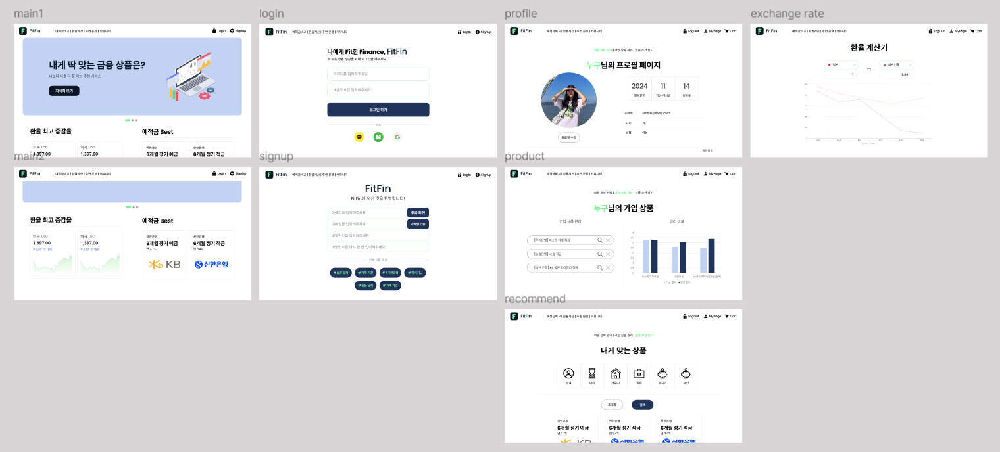

### 설계 내용 및 구현
- 설계 내용 : 예적금 상품 비교, 환율 계산, 은행 검색, 게시판, 회원, 상품 관리, 상품 추천, 회원가입, 로그인(소셜로그인-카카오)
- 실제 구현 : 설계 계획의 95% 이상 구현 

## Github, Notion 사용 정보
### Github 기능 구현 시 순서
1. 구현할 기능에 대한 Git Issue 열기 
2. 추가할 기능 별로 Branch 생성         
3. 생성한 브랜치에서 작업 수행
4. commit 시 commit 컨벤션을 준수 
5. pull request template 대로 작성 및 요청보내기 
6. pull request 승인 후 Issue 닫기 
7. 생성한 브랜치 제거
### Notion
- 일정 관리
- 프로젝트 계획
- 프로젝트 참고 자료 정리
- 페이지 별 요구사항 명세
<!-- 
## 데이터베이스 모델링(ERD)
[!!!! **ERD drawio Link**](https://drive.google.com/file/d/1DKVab0B_zfNrMHybdNuF31o8LawDn5PA/view?usp=sharing)

### API 명세서
!!!!  -->

## 금융 상품 추천 알고리즘 (대출)
### 더미 데이터 생성
- 50명의 회원 더미데이터를 생성하여 사용자와 나이, 직업, 혼인여부, 자산, 소득, 신용 점수가 비슷한 회원이 가입한 대출 상품 추천
- 실제 신용 점수의 분포를 확률에 반영하여 신용 점수 생성
- 신용 등급을 기반으로 가입 가능한 대출 상품 중 0~3개(랜덤) 가입

### 추천 알고리즘
- 회원 가입 시 나이, 직업, 혼인여부, 자산, 소득, 신용 점수 기입
<!-- - !!! 사용자와 유사한 회원을 계산할 조건을 선택받음 -->
- 선택한 조건으로 유저 정보끼리 코사인 유사도를 계산하여 유사한 회원 추출
- 가장 유사한 회원 5명이 가입한 상품 중 가입 가능한 상품 3개 추출
- 가입 가능 조건은 사용자의 신용 점수에 따라 신용 등급을 부여하여 확인
- 신용 등급을 기준으로 사용자의 예상 금리 및 평균 금리 제공

## 대표 기능 설명

### 1. 네비게이션 바
- 탭: 아이콘 및 이름 변경
- 메뉴 바: 예적금 상품 비교, 환율 계산, 내 주변 은행, 커뮤니티
- 로그인 바: 로그인 상태에 따라 회원가입 & 로그인 또는 로그아웃 & 마이페이지

### 2. 메인 페이지

- Carousel: 금융 기능 이미지 및 링크 (마이 페이지, 금융 상품, 환율 계산)
- 환율 최고 증감율: 영업일 기준 현재 시점에서 가장 환율 변동이 큰 환율 정보 그래프 2개
- 예적금 Best: 최고 우대 금리가 가장 높은 예적금 상품 각각 1개

### 3. 로그인, 회원가입 페이지
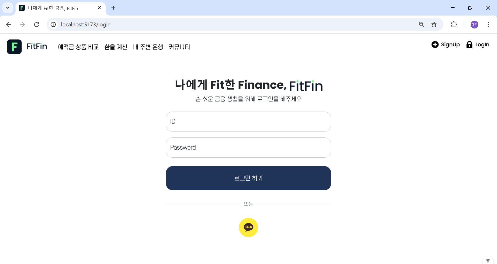
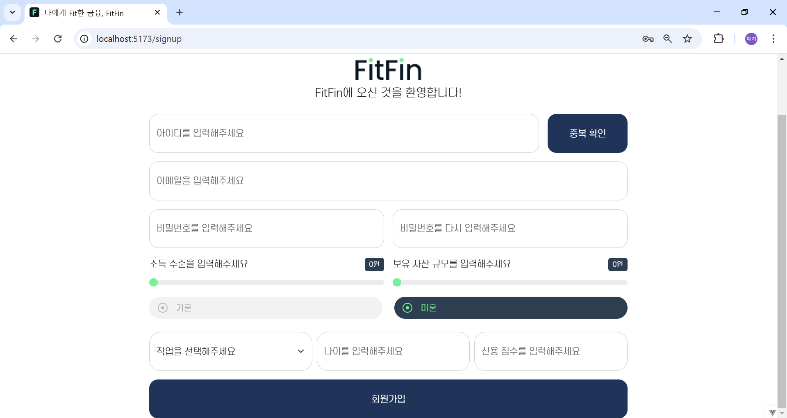
- 회원가입
    - 아이디 중복 확인
    - 비밀번호 일치 여부 확인
    - 나이, 직업, 혼인여부, 자산, 소득, 신용 점수 입력
- 로그인: 카카오 계정 연동

### 4. 마이페이지
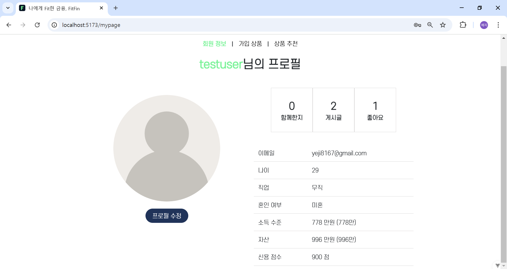
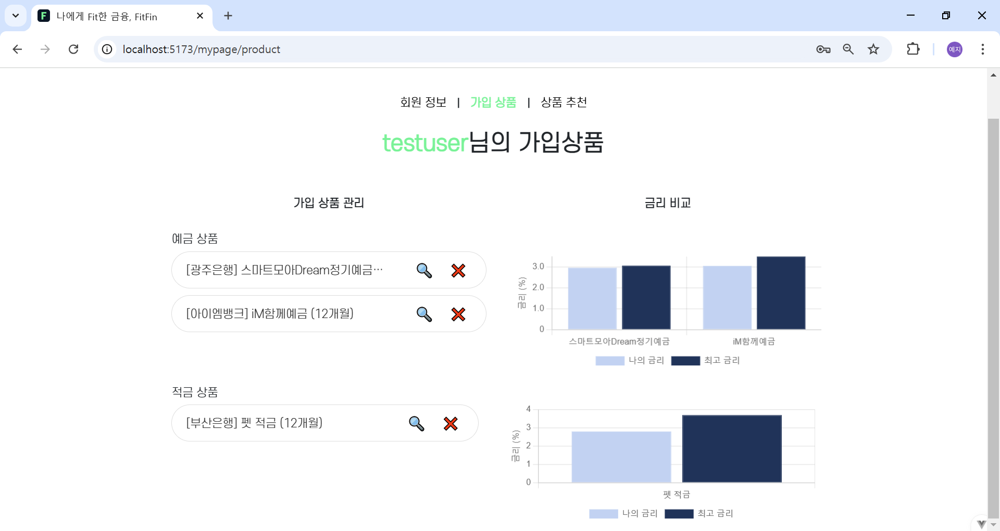
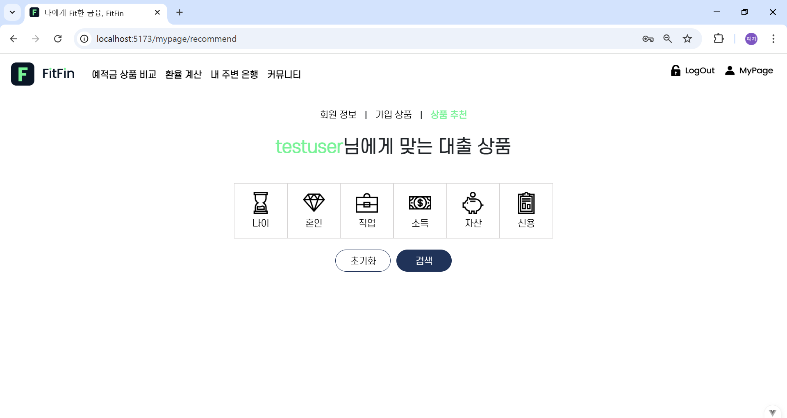
- 회원 정보
    - 사용자 활동 정보: 가입 기간(일), 작성 게시글(수), 좋아요한 게시글(수)
    - 사용자 개인 정보: 이메일, 나이, 직업, 혼인여부, 소득 수준, 자산, 신용 점수 조회
    - 프로필 수정: 사용자 개인 정보 변경 가능

- 가입 상품
    - 가입한 예적금 상품 목록
    - 상품 별 최고 금리, 사용자가 가입한 조건의 상품들의 금리를 그래프로 시각화하여 비교
    - 예적금 가입 상품 해지
    - 예적금 가입 상품 상세보기

- 상품 추천
    - 회원 유사도 계산할 조건 입력
    - 유사한 회원이 가입한 대출 상품 추천

### 5. 금융 상품 비교 페이지
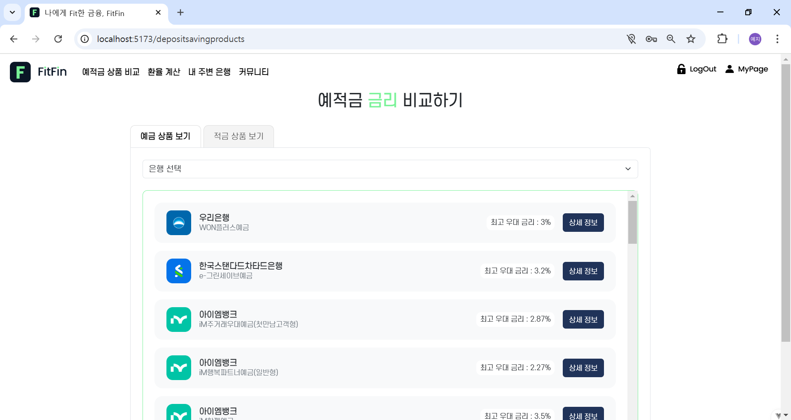
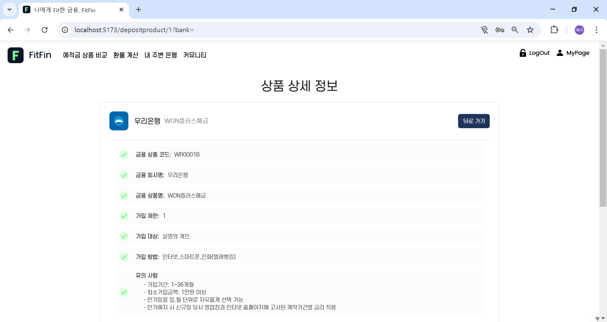
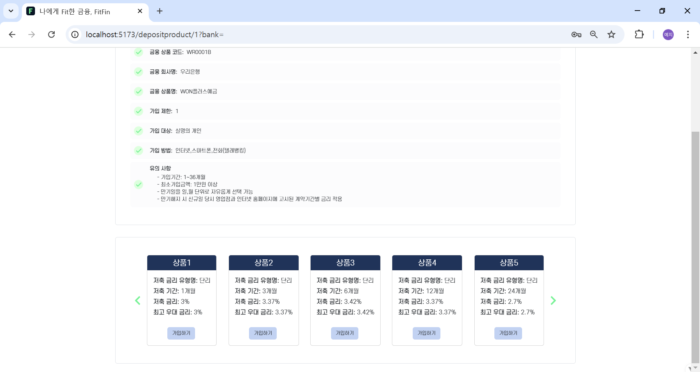

- 금융 상품 비교 페이지
    - 예금 상품 페이지와 적금 상품 페이지를 탭으로 분리
    - 은행 별 상품 선택
    - 은행, 상품, 최고 우대 금리 정보
    - 금융 상품 별 상세 정보

- 상세 정보 페이지
    - 상세 정보 제공
    - 상품의 옵션을 선택하여 상품 가입

### 6. 환율 계산 페이지
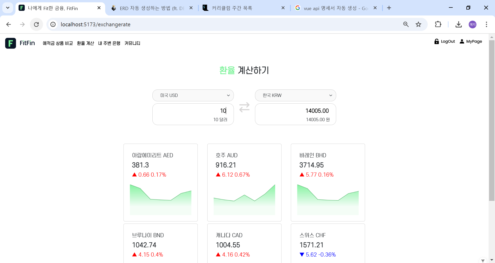

- 나라 2개를 선택하여 환율 계산
- 22개국 영업일 기준 7일 환율 정보 및 그래프 제공
- 영업일 기준 매일 오전 11시이후 자동으로 데이터베이스를 업데이트하여 환율 정보 제공

### 7. 주변 은행 검색 페이지
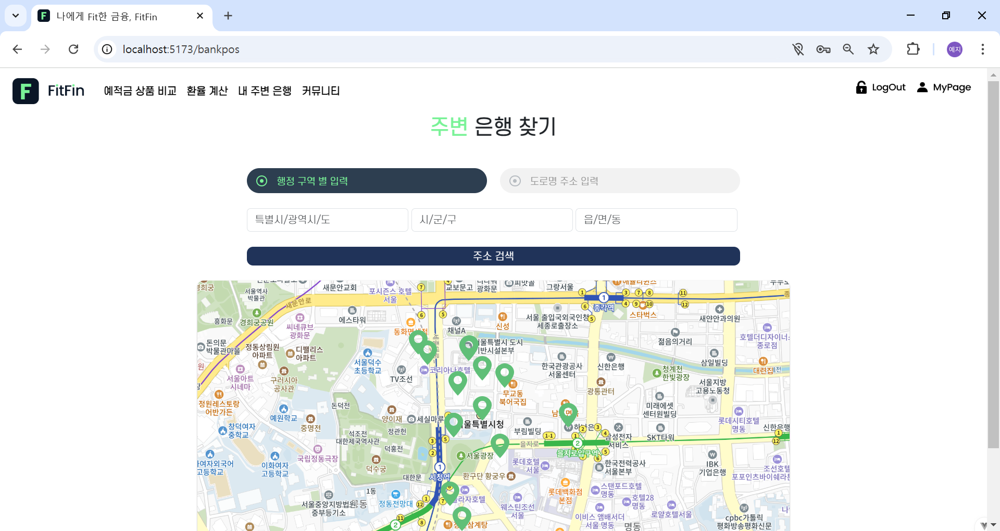

- 초기 설정은 현재 위치에서 은행 검색
- 행정 구역 별 또는 도로명 주소를 입력 받아 주변 은행 15개 지점 검색
- 마커 클릭 시 은행 이름 및 주소 제공

<!-- ### 8. 금융 상품 자유 게시판
!!!!! 
!!!!! 
!!!!! 
!!!!! 
!!!!! 

- 게시물 CRUD와 댓글 CRUD를 제공
- !!! 좋아요 기능 -->

## 프로젝트 후기

* 선예지 : 웹 개발이 처음이라 프로젝트 시작 시 어려움을 느꼈지만, django와 vue3를 공부하면서 점차 역량을 길를 수 있었습니다. 특히, 이론 공부와 실제 구현은 많이 다르다는 것을 느꼈습니다. 실제 개발은 이보다 고려해야할 요소가 많을텐데, 프로젝트 개발 시 겪었던 어려움을 잘 정리해야겠습니다. 이후 배포까지 진행하여 프로젝트를 끝까지 완성해보고 싶습니다.

* 최고운 : Vanila JS를 활용한 웹 개발 경험은 있었지만 Vue3를 처음 공부하고 사용하면서 프레임워크를 활용한 개발의 편리함을 많이 느낄 수 있었습니다. 또한 강의 시간에 배웠던 내용들 외에 추가적인 기능들을 추가하고 구현하는 과정에서 몰랐던 내용들을 알게 되고 배웠던 내용들을 복습할 수 있었습니다. 이후 프로젝트를 리팩토링하며 추천 시스템을 AI를 활용하여 더욱 고도화하고 가능하다면 Mlops 환경까지 구축해보고 싶습니다.
